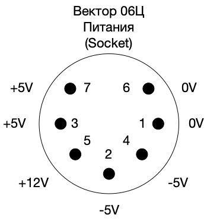

# Powering the Vector-06C.02
The 02 model has a 7-pin socket for power input:
- Pin 1: 0V (ground)
- Pin 2: -5VDC
- Pin 3: +5VDC
- Pin 4: -5VDC
- Pin 5: +12VDC
- Pin 6: 0V (ground)
- Pin 7: +5VDC

## Mean Well GP25A13A-R1B
It is possible to use a Mean Well GP25A13A-R1B power supply (5-pin DIN plug) with some modifications to the Vector's power input. 

[1] De-solder/remove the 7-pin DIN connector from the motherboard. 
[2] Cut the track between pins 2 and 4 on the top side of the motherboard - pin 2 on the Mean Well is 0V so this pin will become unused on the Vector. 
[3] Solder a 7-pin DIN connector back to the same postion. 
[4] Cut the track connecting pin 2 to the -5V rail on the underside of the motherboard. 
[5] Connect pin 4 on the underside of the motherboard to the -5V rail. 

This now matches the Mean Well pinout - the Mean Well 5-pin DIN can be directly connected.

## Other PSUs
You can also create your own PSU by obtaining a tri-voltage AC/DC converter (i.e. Mean Well PT-65A or RPT-65E) and making up some cabling and installing into a suitable box.  You will need connectors as per the datasheet.
